# Azure Autonomous Data Platform — Architecture Diagrams

## 1. System Context (High Level)

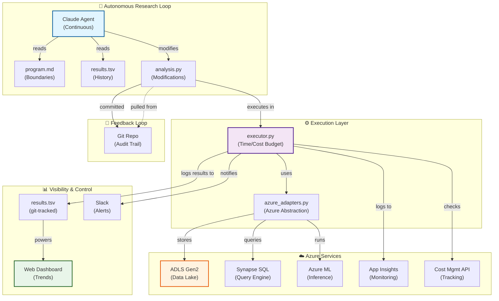

---

## 2. Agent Loop (Detailed Sequence)

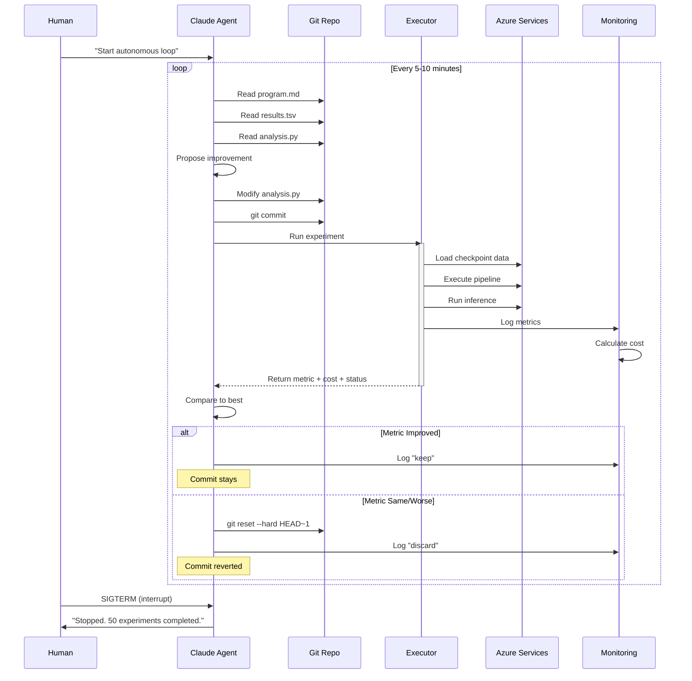

---

## 3. File Structure & Ownership

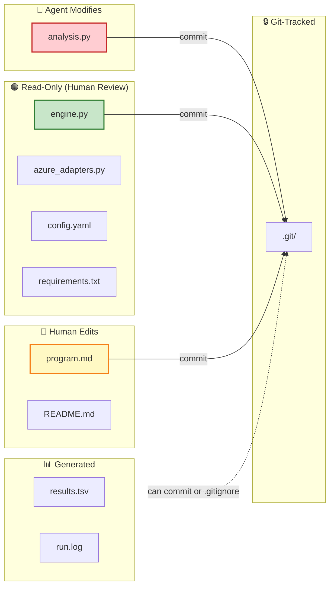

---

## 4. Experiment Execution Pipeline

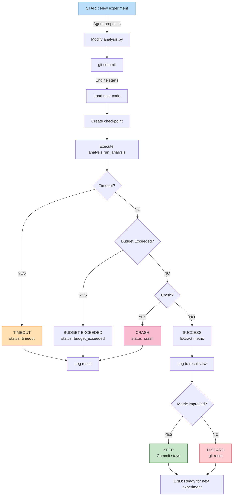

---

## 5. Azure Integration Layer

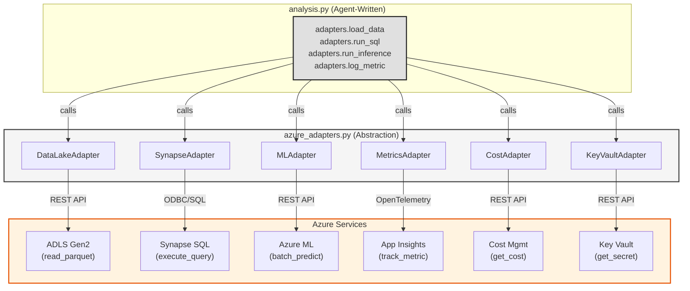

---

## 6. Results Tracking (TSV Format)

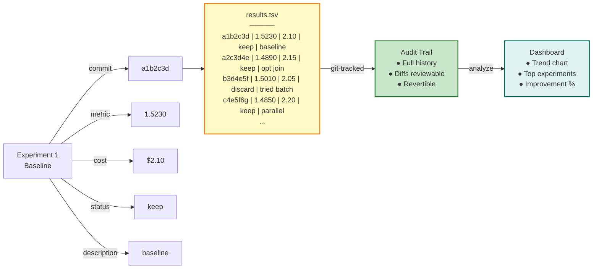

---

## 7. Deployment Architecture

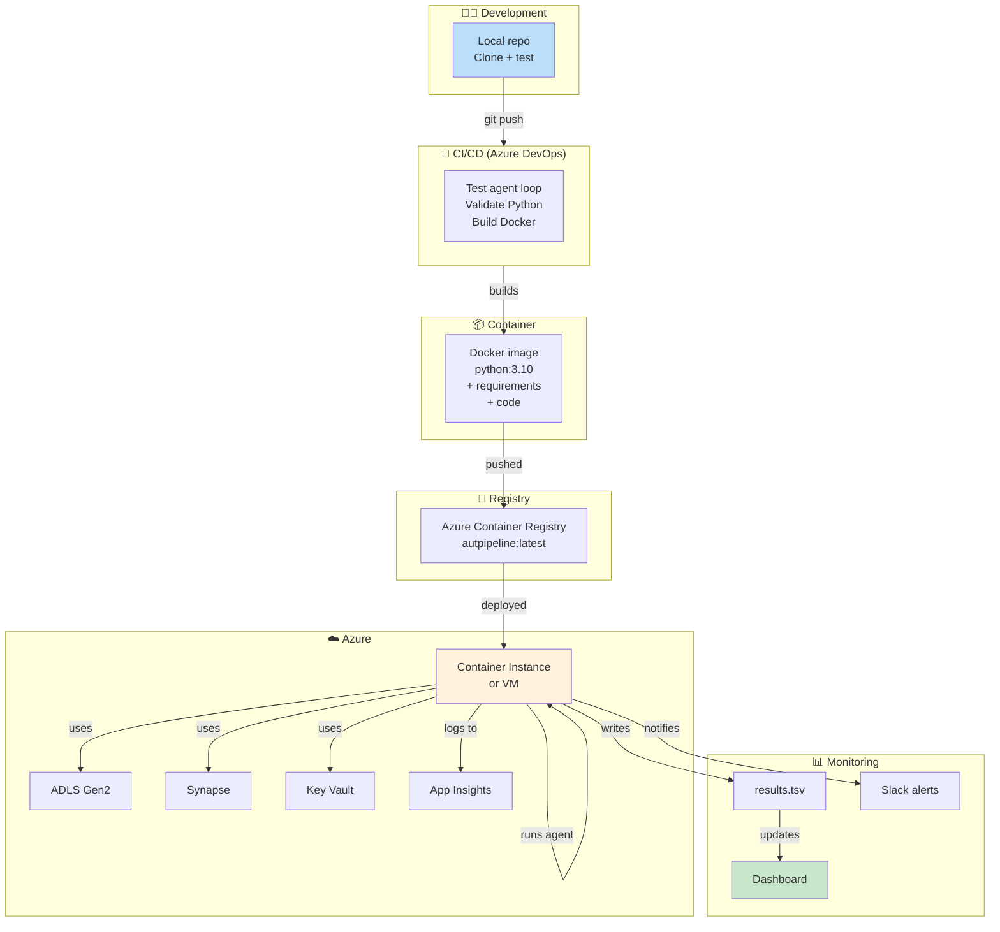

---

## 8. KPI & Health Dashboard

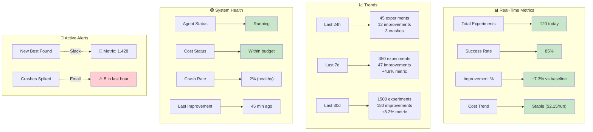

---

## 9. Multi-Pipeline Orchestration (Future)

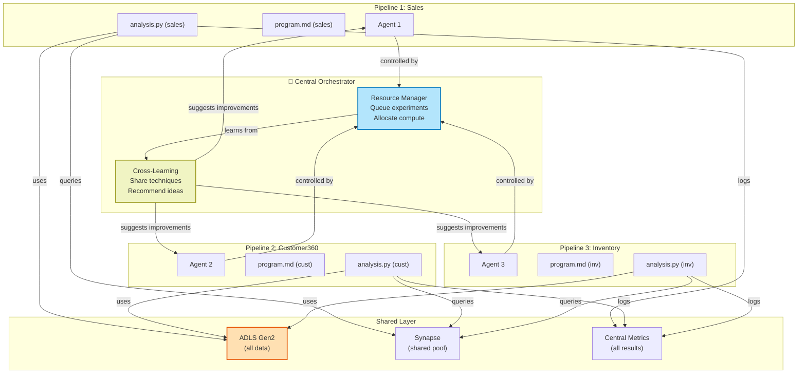

---

## 10. Decision Framework (When to Use)

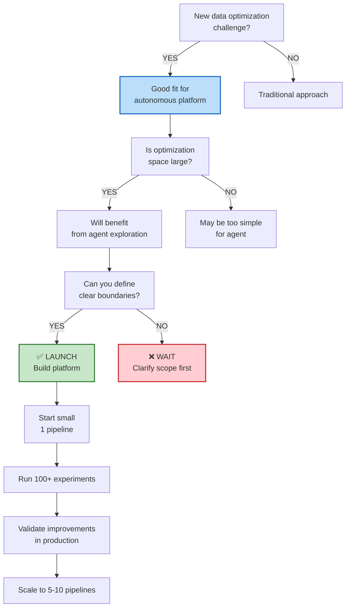

---

## 11. Risk Mitigation Posture

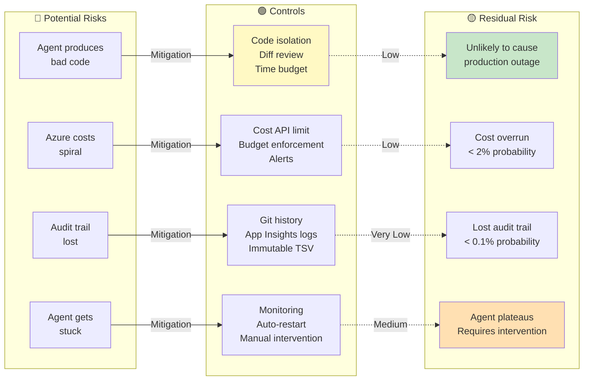

---

## 12. Success Metrics Over Time

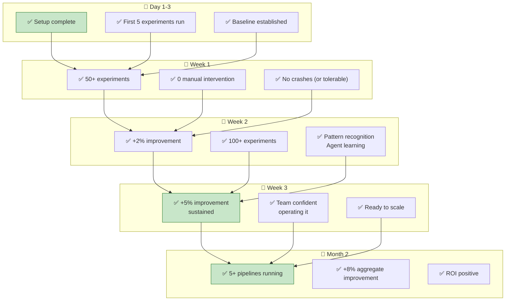

---

## Document Summary

These diagrams illustrate:
1. **System Context** — The big picture
2. **Agent Loop** — How it actually works
3. **File Ownership** — What agent can/cannot change
4. **Execution Pipeline** — Every experiment
5. **Azure Integration** — Service abstractions
6. **Results Tracking** — Audit trail
7. **Deployment** — Getting to production
8. **KPI Dashboard** — Observability
9. **Multi-Pipeline** — Future scaling
10. **Decision Framework** — When to use
11. **Risk Mitigation** — Safety guardrails
12. **Success Timeline** — What "done" looks like

**Use these as references when** designing architecture, explaining to stakeholders, or debugging issues.
