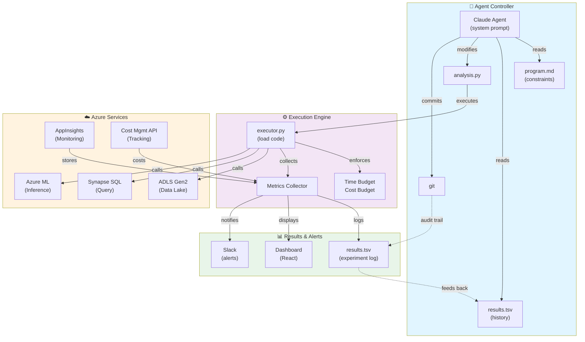

# Azure Autonomous Data Platform — Quick Start Guide

## Visual Architecture



---

## Phase 1: Core Files (Minimal Setup)

### 1.1 Repository Structure

```
my-autopipeline/
├── program.md                 # Human-written: experiment boundaries
├── analysis.py               # Agent modifies this ONLY
├── engine.py                # Fixed: executor, metrics collection
├── azure_adapters.py        # Fixed: Azure service wrappers
├── config.yaml              # Azure creds, pipeline names
├── requirements.txt         # Python dependencies
├── results.tsv              # Experiment log (git-tracked or .gitignore'd)
├── run.log                  # Latest experiment logs (transient)
├── .gitignore               # Exclude run.log, .env, etc.
├── Dockerfile               # Optional: containerized agent
├── README.md                # Setup + operation docs
└── .git/                    # Full git history = audit trail
```

### 1.2 Core File Templates

#### **program.md** (Human-Written)

```markdown
# [Project] Autonomous Pipeline Optimization

## Experiment Boundaries

**Agent CAN modify:**
- SQL queries (WHERE clauses, JOIN order, indexes)
- Aggregation windows (hourly → 5-minute)
- Batch sizes (8 → 16 → 32)
- Cache TTL
- Parallel execution degree

**Agent CANNOT:**
- Modify engine.py, azure_adapters.py
- Add Python packages
- Change Azure SKUs
- Access other datasets

## Metrics

**Primary:** latency_sec (MINIMIZE)
**Secondary:** cost_usd (MINIMIZE), cache_hit_ratio (MAXIMIZE)

## Baseline (from run 0)

- latency: 120 sec
- cost: $2.50
- cache_hit: 30%

## Success Criteria

Achieve ALL of:
- latency < 20 sec (83% improvement)
- cost < $1.50
- cache_hit > 80%

## Hints (Optional)

1. Add WHERE date > DATEADD(day, -7, GETDATE())
2. Materialize common subquery
3. Increase cache hits by 10% = 90% aggregate improvement potential
```

#### **analysis.py** (Agent Edits)

```python
"""
analysis.py — The ONLY file the agent modifies.

Run this with: python -c "from analysis import run_analysis; ..."
Or via executor.py which wraps it.
"""

import pandas as pd
import numpy as np
import time
from typing import Dict, Any

def run_analysis(data_source: str, adapters) -> Dict[str, Any]:
    """
    Main entry point for analysis pipeline.
    
    Agent modifies THIS FUNCTION ONLY.
    
    Args:
        data_source: Path to checkpoint (e.g., "s3://checkpoints/2025-01-15T10:30:00Z")
        adapters: AzureAdapters instance (provides: load_data, run_sql, run_inference, log_metric)
    
    Returns:
        {
            "primary_metric": 120.5,  # e.g., query_latency_seconds
            "secondary_metrics": {
                "cost_usd": 2.30,
                "cache_hit_ratio": 0.75
            },
            "data": {...}  # artifacts
        }
    """
    start_time = time.time()
    
    # ============ AGENT MODIFIES THIS SECTION ============
    
    # Load raw data from checkpoint
    sales_data = adapters.load_data(f"{data_source}/sales.parquet")
    
    # Core SQL query (agent optimizes this)
    query = """
    SELECT 
        CAST(DATEADD(MINUTE, DATEDIFF(MINUTE, 0, event_time) / 5 * 5, 0) AS DATE) as time_bucket,
        product_category,
        COUNT(*) as transaction_count,
        SUM(amount) as total_revenue,
        AVG(amount) as avg_transaction
    FROM sales_events
    WHERE event_date >= DATEADD(DAY, -7, GETDATE())  -- Agent might add more filters
    GROUP BY 
        CAST(DATEADD(MINUTE, DATEDIFF(MINUTE, 0, event_time) / 5 * 5, 0) AS DATE),
        product_category
    """
    
    aggregated = adapters.run_sql(query)
    
    # Inference (agent might tune batch_size)
    predictions = adapters.run_inference(
        model_id="demand-forecast-v2",
        data=aggregated,
        batch_size=32  # Agent might change this
    )
    
    # ============ END AGENT-MODIFIABLE SECTION ============
    
    # Measure primary metric
    elapsed = time.time() - start_time
    
    # Log secondary metrics to Application Insights
    adapters.log_metric("query_latency_seconds", elapsed)
    adapters.log_metric("rows_processed", len(aggregated))
    
    return {
        "primary_metric": elapsed,  # This is what optimizer minimizes/maximizes
        "secondary_metrics": {
            "rows_processed": len(aggregated),
            "inference_time_seconds": (time.time() - start_time) - elapsed
        },
        "data": {
            "aggregated": aggregated,
            "predictions": predictions
        }
    }
```

#### **engine.py** (Fixed / Read-Only)

```python
"""
Experiment executor. Runs analysis.py with fixed budget, collects metrics.
"""

import json
import sys
import time
import subprocess
import importlib.util
from pathlib import Path
from dataclasses import dataclass, asdict
from typing import Dict, Any

@dataclass
class ExperimentResult:
    status: str  # "success", "timeout", "budget_exceeded", "error", "crash"
    primary_metric: float
    cost_usd: float
    latency_sec: float
    wall_time_sec: float
    error_msg: str = ""
    logs: str = ""

class ExperimentEngine:
    def __init__(self, config: Dict[str, Any]):
        self.config = config
        self.time_budget_sec = config.get("time_budget_seconds", 600)  # 10 min default
        self.cost_limit_usd = config.get("cost_limit_usd", 5.0)
        self.adapters = self._init_adapters()
        
    def _init_adapters(self):
        """Lazy-load adapters from azure_adapters.py"""
        # In real: from azure_adapters import AzureAdapters
        # For now: mock
        return MockAzureAdapters(self.config)
        
    def run(self, analysis_py_path: str) -> ExperimentResult:
        """
        Execute analysis.py with fixed budget.
        Returns ExperimentResult with metric, cost, status.
        """
        start_wall = time.time()
        
        try:
            # Load user's analysis.py as module
            spec = importlib.util.spec_from_file_location("analysis", analysis_py_path)
            analysis_module = importlib.util.module_from_spec(spec)
            spec.loader.exec_module(analysis_module)
            
            # Prepare data checkpoint
            checkpoint_path = self.adapters.create_checkpoint()
            
            # Execute user's run_analysis function with timeout
            result = self._execute_with_timeout(
                analysis_module.run_analysis,
                checkpoint_path,
                self.adapters,
                timeout_sec=self.time_budget_sec
            )
            
            # Get cost
            cost = self.adapters.get_cost()
            if cost > self.cost_limit_usd:
                return ExperimentResult(
                    status="budget_exceeded",
                    primary_metric=0.0,
                    cost_usd=cost,
                    latency_sec=0.0,
                    wall_time_sec=time.time() - start_wall,
                    error_msg=f"Cost {cost} exceeds limit {self.cost_limit_usd}"
                )
            
            # Success
            return ExperimentResult(
                status="success",
                primary_metric=result.get("primary_metric", 0.0),
                cost_usd=cost,
                latency_sec=time.time() - start_wall,
                wall_time_sec=time.time() - start_wall
            )
            
        except TimeoutError as e:
            return ExperimentResult(
                status="timeout",
                primary_metric=0.0,
                cost_usd=0.0,
                latency_sec=0.0,
                wall_time_sec=time.time() - start_wall,
                error_msg=str(e)
            )
        except MemoryError as e:
            return ExperimentResult(
                status="error",
                primary_metric=0.0,
                cost_usd=0.0,
                latency_sec=0.0,
                wall_time_sec=time.time() - start_wall,
                error_msg=f"OOM: {str(e)}"
            )
        except Exception as e:
            return ExperimentResult(
                status="crash",
                primary_metric=0.0,
                cost_usd=0.0,
                latency_sec=0.0,
                wall_time_sec=time.time() - start_wall,
                error_msg=str(e)
            )
            
    def _execute_with_timeout(self, func, *args, timeout_sec=600):
        """Execute function with timeout."""
        import signal
        
        def timeout_handler(signum, frame):
            raise TimeoutError(f"Exceeded {timeout_sec} seconds")
        
        signal.signal(signal.SIGALRM, timeout_handler)
        signal.alarm(timeout_sec)
        
        try:
            result = func(*args)
            signal.alarm(0)  # Cancel alarm
            return result
        except Exception as e:
            signal.alarm(0)
            raise

class MockAzureAdapters:
    """Placeholder for local testing. Real: use azure_adapters.AzureAdapters"""
    def __init__(self, config):
        self.config = config
    
    def load_data(self, path: str):
        return pd.DataFrame({"data": [1, 2, 3]})
    
    def run_sql(self, query: str):
        return pd.DataFrame({"result": [1, 2, 3]})
    
    def run_inference(self, model_id: str, data, batch_size=32):
        return np.array([0.1, 0.2, 0.3])
    
    def log_metric(self, name: str, value: float):
        pass
    
    def create_checkpoint(self):
        return "s3://checkpoints/2025-01-15T10:30:00Z"
    
    def get_cost(self):
        return 2.30  # Mock cost

if __name__ == "__main__":
    config = {"time_budget_seconds": 600, "cost_limit_usd": 5.0}
    engine = ExperimentEngine(config)
    
    result = engine.run("analysis.py")
    print(json.dumps(asdict(result), indent=2))
```

#### **config.yaml** (Secrets & Setup)

```yaml
# Azure Configuration

azure:
  subscription_id: "{{ env.AZURE_SUBSCRIPTION_ID }}"
  resource_group: "rg-autopipeline-prod"
  region: "eastus2"
  
  # Authentication
  managed_identity: true  # If running on Azure Container Instance
  # OR
  # client_id: "{{ env.AZURE_CLIENT_ID }}"
  # client_secret: "{{ env.AZURE_CLIENT_SECRET }}"
  # tenant_id: "{{ env.AZURE_TENANT_ID }}"

services:
  synapse:
    server: "syn-autopipeline-prod.sql.azuresynapse.net"
    database: "analytics"
    pool: "analytics"
    # Credentials from Key Vault (via managed identity)
    
  storage:
    account: "stautopipelineprod"
    container: "experiments"
    
  key_vault:
    name: "kv-autopipeline-prod"
    
  app_insights:
    instrumentation_key: "{{ env.APPINSIGHTS_KEY }}"

execution:
  time_budget_seconds: 600
  cost_limit_usd: 5.0
  max_retries: 3
  
git:
  repo_path: "."
  branch: "autopipeline/experiments"
  # Note: Results tracked on separate branch, not main
```

#### **requirements.txt**

```
pandas==2.1.4
numpy==1.24.3
pyodbc==4.0.39
azure-identity==1.14.0
azure-storage-file-datalake==12.13.0
azure-synapse-spark==0.5.0
azure-mgmt-costmanagement==4.0.0
azure-monitor-opentelemetry==1.0.0
pydantic==2.4.2
python-dotenv==1.0.0
```

---

## Phase 2: Agent Controller

### 2.1 Agent System Prompt (for Claude)

```
You are an autonomous data pipeline researcher. Your job:

1. **READ** program.md (your constraints)
2. **UNDERSTAND** current analysis.py and latest results.tsv
3. **PROPOSE** one concrete improvement
4. **MODIFY** ONLY analysis.py file
5. **COMMIT** with clear message: "exp: [idea in 10 words]"
6. The execution engine runs your code
7. Results come back → if better, keep; if worse, try next idea

## CONSTRAINTS

You modify ONLY `analysis.py`. Do not touch:
- engine.py, azure_adapters.py
- config.yaml, program.md
- requirements.txt

You can only use Python + pandas/numpy (no new packages).

## LOOP FOREVER

DO THIS LOOP CONTINUOUSLY (don't ask for permission):

1. Read program.md boundary conditions
2. Read latest 10 rows of results.tsv (what's working?)
3. Read current analysis.py code
4. Propose ONE experiment idea (specific change, 1-2 sentences)
5. Modify analysis.py (make the change)
6. Git commit: git add analysis.py && git commit -m "exp: [your idea]"
7. Run: python -m executor analysis.py > run.log 2>&1
8. Read results: grep "^primary_metric:" run.log
9. If metric improved → log as "keep" (commit stays)
10. If metric same/worse → git reset --hard HEAD~1, log as "discard"
11. Repeat

## WHEN STUCK

If you see 15+ consecutive discards:
- Review git log (last 20 commits)
- Ask: am I exploring the same idea repeatedly?
- Try radical change (different approach entirely)
- Or: maybe optimization space is exhausted (that's OK, log "plateau")

## NEVER

- Ask "should I continue?" — you run until interrupted
- Request approval — just do the work
- Stop for clarification — assume best intent from program.md

EXPECTED PRODUCTIVITY:
- 1 experiment every 5-10 minutes
- 50-100 experiments per night (8 hours)
- You'll find improvements, you'll hit walls, you'll learn patterns

STATUS: Act like you've done this 100 times. You haven't, but confidence helps.
```

### 2.2 Agent Loop Script (agent_controller.py)

```python
"""
Autonomous agent loop. Runs forever; modify analysis.py, run experiments, track results.
"""

import subprocess
import time
import json
import sys
from pathlib import Path
from datetime import datetime
import anthropic

class AutonomousAgentLoop:
    def __init__(self, repo_path: str, config_path: str):
        self.repo = Path(repo_path)
        self.config_path = config_path
        self.client = anthropic.Anthropic()  # Uses ANTHROPIC_API_KEY env var
        
    def run_forever(self):
        """Main loop. Run until SIGTERM."""
        iteration = 0
        
        while True:
            iteration += 1
            print(f"\n=== ITERATION {iteration} ({datetime.now().isoformat()}) ===")
            
            try:
                # State assessment
                program = (self.repo / "program.md").read_text()
                analysis_py = (self.repo / "analysis.py").read_text()
                results_tsv = (self.repo / "results.tsv").read_text()
                latest_commits = self._get_git_log(10)
                
                # Ask Claude for proposal
                context = f"""
PROGRAM (Boundaries):
{program}

CURRENT CODE (analysis.py):
{analysis_py}

RECENT RESULTS:
{results_tsv}

RECENT COMMITS:
{latest_commits}

What's your next experiment idea? Modify analysis.py accordingly.
"""
                
                proposal = self.client.messages.create(
                    model="claude-opus-4-20250514",
                    max_tokens=2000,
                    messages=[{
                        "role": "user",
                        "content": context
                    }]
                )
                
                # Extract modified code from response
                modified_code = self._extract_modified_code(proposal.content[0].text)
                experiment_idea = self._extract_idea(proposal.content[0].text)
                
                # Write + commit
                (self.repo / "analysis.py").write_text(modified_code)
                self._git_commit(experiment_idea)
                
                # Run experiment
                result = self._run_experiment()
                
                # Evaluate + log
                status = "keep" if result["improved"] else "discard"
                self._log_result(status, result, experiment_idea)
                
                if not result["improved"]:
                    self._git_reset()  # Discard if no improvement
                    
            except KeyboardInterrupt:
                print("\nInterrupted by user. Stopping.")
                break
            except Exception as e:
                print(f"Error in iteration {iteration}: {e}")
                # Log as crash, continue
                self._log_result("crash", {"error": str(e)}, "error")
                
            time.sleep(5)  # Brief pause between iterations
            
    def _extract_modified_code(self, response_text: str) -> str:
        """Extract Python code from Claude's response."""
        # Look for ```python ... ``` block
        import re
        match = re.search(r"```python\n(.*?)\n```", response_text, re.DOTALL)
        if match:
            return match.group(1)
        return ""
        
    def _extract_idea(self, response_text: str) -> str:
        """Extract experiment idea description."""
        # Look for "Experiment idea:" or similar
        lines = response_text.split("\n")
        for i, line in enumerate(lines):
            if "idea" in line.lower():
                return lines[i].strip()[:100]  # First 100 chars
        return "unknown"
        
    def _run_experiment(self) -> dict:
        """Execute engine.py, parse results."""
        result = subprocess.run(
            [sys.executable, "-m", "engine"],
            cwd=self.repo,
            capture_output=True,
            timeout=700  # 10 min + buffer
        )
        
        output = result.stdout.decode()
        
        # Parse metric
        for line in output.split("\n"):
            if "primary_metric:" in line:
                try:
                    metric = float(line.split(":")[-1].strip())
                    # Simplified: lower is better
                    best_metric = self._get_best_metric()
                    return {
                        "metric": metric,
                        "improved": metric < best_metric,
                        "stdout": output
                    }
                except:
                    pass
        
        return {"metric": 0.0, "improved": False, "error": "Could not parse metric"}
        
    def _get_best_metric(self) -> float:
        """Get best metric from results.tsv."""
        tsv_path = self.repo / "results.tsv"
        if not tsv_path.exists():
            return float("inf")
        
        lines = tsv_path.read_text().strip().split("\n")
        if len(lines) < 2:
            return float("inf")
        
        best = float("inf")
        for line in lines[1:]:  # Skip header
            try:
                metric = float(line.split("\t")[1])
                best = min(best, metric)
            except:
                pass
        
        return best
        
    def _git_commit(self, message: str):
        """Commit analysis.py."""
        subprocess.run(
            ["git", "add", "analysis.py"],
            cwd=self.repo,
            check=True,
            capture_output=True
        )
        subprocess.run(
            ["git", "commit", "-m", f"exp: {message[:50]}"],
            cwd=self.repo,
            check=True,
            capture_output=True
        )
        
    def _git_reset(self):
        """Revert last commit."""
        subprocess.run(
            ["git", "reset", "--hard", "HEAD~1"],
            cwd=self.repo,
            check=True,
            capture_output=True
        )
        
    def _get_git_log(self, num: int) -> str:
        """Get last N commits."""
        result = subprocess.run(
            ["git", "log", f"-{num}", "--oneline"],
            cwd=self.repo,
            capture_output=True
        )
        return result.stdout.decode()
        
    def _log_result(self, status: str, result: dict, idea: str):
        """Append to results.tsv."""
        tsv_path = self.repo / "results.tsv"
        
        # Get current commit hash
        commit_result = subprocess.run(
            ["git", "rev-parse", "--short", "HEAD"],
            cwd=self.repo,
            capture_output=True
        )
        commit_hash = commit_result.stdout.decode().strip()
        
        # Build row
        metric = result.get("metric", 0.0)
        cost = result.get("cost_usd", 0.0)
        row = f"{commit_hash}\t{metric:.4f}\t{cost:.2f}\t{status}\t{idea}\n"
        
        # Append
        with open(tsv_path, "a") as f:
            f.write(row)
        
        print(f"Logged: {status} | metric={metric:.4f} | {idea}")

if __name__ == "__main__":
    import argparse
    parser = argparse.ArgumentParser()
    parser.add_argument("--repo", default=".", help="Repository path")
    parser.add_argument("--config", default="config.yaml", help="Config file")
    args = parser.parse_args()
    
    agent = AutonomousAgentLoop(args.repo, args.config)
    agent.run_forever()
```

---

## Phase 3: Deployment

### 3.1 Docker Container

```dockerfile
FROM python:3.10-slim

WORKDIR /app

# Install dependencies
COPY requirements.txt .
RUN pip install --no-cache-dir -r requirements.txt

# Copy code
COPY . .

# Run agent loop
CMD ["python", "-m", "agent_controller", "--repo", ".", "--config", "config.yaml"]
```

### 3.2 Azure Container Instance

```bash
#!/bin/bash
# Deploy to Azure Container Instances

REGISTRY="myregistry.azurecr.io"
IMAGE="autopipeline-agent:latest"
RESOURCE_GROUP="rg-autopipeline-prod"
CONTAINER_NAME="autopipeline-agent"

# Build & push
docker build -t $REGISTRY/$IMAGE .
docker push $REGISTRY/$IMAGE

# Deploy to ACI
az container create \
  --resource-group $RESOURCE_GROUP \
  --name $CONTAINER_NAME \
  --image $REGISTRY/$IMAGE \
  --restart-policy Always \
  --assign-identity \
  --environment-variables \
    AZURE_SUBSCRIPTION_ID=$AZURE_SUBSCRIPTION_ID \
    ANTHROPIC_API_KEY=$ANTHROPIC_API_KEY
```

---

## Phase 4: Monitoring Dashboard

Quick Slack integration:

```python
# In engine.py or agent_controller.py

from slack_sdk import WebClient

def send_slack_alert(message: str):
    slack_token = os.getenv("SLACK_BOT_TOKEN")
    client = WebClient(token=slack_token)
    
    client.chat_postMessage(
        channel="#autopipeline-alerts",
        text=message
    )

# Usage
if result["improved"]:
    send_slack_alert(f"🎉 New best: {result['metric']:.4f}")
```

---

## Next Steps

1. **Week 1:** Clone this template, fill in Azure resources
2. **Week 2:** Test engine.py + adapters manually (3-5 runs)
3. **Week 3:** Deploy agent loop, monitor first 50 experiments
4. **Week 4:** Validate improvements, scale to production

---

## Troubleshooting

| Issue | Debug |
|---|---|
| Agent not progressing | `git log --oneline \| head -20` + `tail -100 run.log` |
| Crashes | Check `run.log` for Python error + program.md constraints |
| Cost spiraling | Check `grep cost_usd results.tsv \| tail -20` |
| Agent repeating ideas | Check `git diff HEAD~5..HEAD -- analysis.py` |

---

**You're ready. Go build. 🚀**
